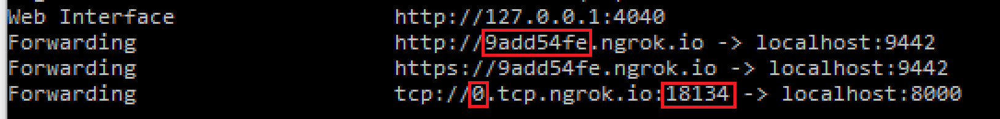

# Introduction

## About

The Hue Bot sample guides you through building, deploying and testing an application hosted media bot. This sample demonstrates how bots can interact with users by enabling real-time video capabilities.

## Getting Started

This section walks you through the process of deploying and testing the sample bot in Azure Kubernetes Service (AKS). You have two options: deploy to Azure or run locally on your dev box. Many of the steps are common; wherever they diverge, they are specifically marked as [Local] or [Azure]

For running locally, we need to use a tunneling mechanism to route traffic to your dev box. You can find the concepts documented [here](https://microsoftgraph.github.io/microsoft-graph-comms-samples/docs/articles/Testing.html). While the steps for running locally can seem a bit longer, the deployments are much faster and convenient for tweaking and playing with the samples.

### Bot Registration

1. Follow the steps in [Register Calling Bot](https://microsoftgraph.github.io/microsoft-graph-comms-samples/docs/articles/calls/register-calling-bot.html).  

1. Add the following Application Permissions to the bot:

    * Calls.AccessMedia.All
    * Calls.Initiate.All
    * Calls.JoinGroupCall.All
    * Calls.JoinGroupCallAsGuest.All

1. The permissions need to be consented by tenant admin. Go to "https://login.microsoftonline.com/common/adminconsent?client_id=<app_id>&state=<any_number>&redirect_uri=<any_callback_url>" using tenant admin to sign-in, then consent for the whole tenant.

### Prerequisites

* Install the prerequisites:
    * [Visual Studio 2017](https://visualstudio.microsoft.com/downloads/)
    * [Azure Kubernetes Service (AKS)](https://learn.microsoft.com/en-us/azure/aks/)
    * [Azure CLI](https://docs.microsoft.com/en-us/cli/azure/install-azure-cli?view=azure-cli-latest)
    * [Kubectl](https://kubernetes.io/docs/reference/generated/kubectl/kubectl-commands)
    * [Docker](https://docs.docker.com/)
    * [Helm](https://docs.docker.com/)
    * [Azure PowerShell](https://docs.microsoft.com/en-us/powershell/azure/install-azurerm-ps?view=azurermps-6.8.1)
    * [PostMan](https://chrome.google.com/webstore/detail/postman/fhbjgbiflinjbdggehcddcbncdddomop)
    * [Local] [ngrok](https://ngrok.com/)

* Set up SSL certificate:
    1. Create a certificate for your service. This certificate should not be a self-signed certificate.
        * Create a wildcard certificate. For instance, if your bot is hosted at `bot.contoso.com`, create the certificate for `*.contoso.com`.

    1. [Azure] Upload the certificate to your key-vault instance.

        

        

    1. [Azure] Copy the Secret Identifier to be used later.

        

    1. Install the certificate to the LocalMachine/My certificate folder on your dev machine, including the private keys. Save the thumbprint for later.

* [Local] ngrok
    1. Sign up for a free ngrok account. Once signed up, go to the ngrok [dashboard](https://dashboard.ngrok.com/) and get your auth token.

    1. Create an ngrok configuration file `ngrok.yml` as follows:
        ```yaml
        authtoken: %replace_with_auth_token_from_dashboard%
        tunnels:
          signaling:
            addr: 9442
            proto: http
          media: 
            addr: 8445
            proto: tcp
        ```

    1. Start ngrok: `ngrok.exe start -all -config %replace_with_path_to_your_ngrok.yml%`. You will see an output like this:

        

    1. From **your** output, note the 3 values in the places marked in red above. From now on, we will call them by these names:
       * `9add54fe` - ngrok signaling prefix
       * `0` - ngrok media prefix
       * `18134` - ngrok media port

    1. Set up a DNS CNAME entry for `%replace_with_ngrok_media_prefix%.contoso.com` pointing to `%replace_with_ngrok_media_prefix%.tcp.ngrok.io`. Example: `0.contoso.com` to `0.tcp.ngrok.io`.

### Code

* Run the `configure_cloud.ps1` script to configure your application.
    * Open a powershell session and navigate to the `/Samples` folder.
    * Run the following command

    ```Powershell
    .\configure_cloud.ps1 -p .\V1.0Samples\LocalMediaSamples\HueBot `
        -dns {full cluster name: huebotxxxxx.xxxx.cloudapp.azure.com} `
        -cn {full cluster name: huebotxxxxx.xxxx.cloudapp.azure.com} `
        -thumb ABC0000000000000000000000000000000000CBA `
        -bid {bot/cluster name: HueBotxxxxx} `
        -aid {application id created during registration} `
        -as {application secret created during registration}
    ```

Alternatively, you can configure your solution manually.

* Open the `HueBot.sln` in Visual Studio 2017 and search/replace these values:
    * `%AppId%` and `%AppSecret%` that you obtained during application registration.
    * `%BotNameLower%` with your desired service fabric cluser name.
    * Replace all `%ServiceDns%` with your full cluster name (I.E. huebotxxxxx.xxxx.cloudapp.azure.com).
    * Replace all `%CName%` with your full cluster name (I.E. huebotxxxxx.xxxx.cloudapp.azure.com).
    * Replace all certificate thumbprint `ABC0000000000000000000000000000000000CBA` with your certificate.

### Deploy

#### [Azure] deployment

1.  Create an Azure Kubernetes Service (AKS) Cluster:

    1. **Log in to Azure**:

   ```bash
   az login
   ```

    2. **Set the desired subscription** (if you have multiple subscriptions):

   ```bash
   az account set --subscription "<subscription_id>"
   ```

    3. **Create a Resource Group**:

   ```bash
   az group create --name HueBotResourceGroup --location "<Azure_Region>"
   ```

    4. **Create the AKS Cluster**:

   ```bash
   az aks create --resource-group HueBotResourceGroup --name HueBotAKSCluster --node-count 3 --enable-addons monitoring --generate-ssh-keys
   ```

    5. **Configure kubectl to Use the New Cluster**:

   ```bash
   az aks get-credentials --resource-group HueBotResourceGroup --name HueBotAKSCluster
   ```

   Verify the connection:

   ```bash
   kubectl get nodes
   ```
2.  Build and Push the HueBot Docker Image:

    1. **Navigate to the HueBot Source Directory**:

   ```bash
   cd path/to/HueBot
   ```

    2. **Build the Docker Image**:

   ```bash
   docker build -t huebot:latest .
   ```

    3. **Tag the Docker Image for Azure Container Registry (ACR)**:

   ```bash
   az acr create --resource-group HueBotResourceGroup --name HueBotACR --sku Basic
   az acr login --name HueBotACR
   docker tag huebot:latest HueBotACR.azurecr.io/huebot:latest
   ```

    4. **Push the Image to ACR**:

   ```bash
   docker push HueBotACR.azurecr.io/huebot:latest
   ```
3. Deploy HueBot to AKS:

    1. **Deploy the Application**:
    
    ```bash
   kubectl apply -f huebot-deployment.yaml
    ```
    2. **Expose the Deployment as a Service** (`huebot-service.yaml`):

    ```yaml
   apiVersion: v1
   kind: Service
   metadata:
     name: huebot-service
   spec:
     type: LoadBalancer
     ports:
     - port: 80
       targetPort: 80
     selector:
       app: huebot
   ```

   Apply the service:

   ```bash
   kubectl apply -f huebot-service.yaml
   ```

   Monitor the service to get the external IP:

   ```bash
   kubectl get service huebot-service
   ```

#### [Local] deployment

In the `HueBot.sln` you have open in VS, right-click `HueBotSF` project and select `Set as StartUp Project`.

Click `Start` on the top toolbar to deploy the sample to the local cluster.

### Test

1. Schedule a Teams meeting with another person.

    

2. Copy the Join Microsoft Teams Meeting link. Depending on where you copy this, this may be encoded as a safe link in Outlook. If it's encoded, you can use it directly. If it's decoded, replace every " in the link with \\".

    

    Example, `https://teams.microsoft.com/l/meetup-join/19:cd9ce3da56624fe69c9d7cd026f9126d@thread.skype/1509579179399?context={"Tid":"72f988bf-86f1-41af-91ab-2d7cd011db47","Oid":"550fae72-d251-43ec-868c-373732c2704f","MessageId":"1536978844957"}`

3. Join the meeting from the Teams client and start up video.

4. Interact with your service, _adjusting the service URL appropriately_. Target port 9441 for the first request to the load balancer. The returned URL will be on a different port/node that picked up the call.
    1. Use Postman to post the following `JSON` payload.

        ##### Request
        ```json
            POST https://huebotxxxxx.xxxx.cloudapp.azure.com:9441/joinCall
            Content-Type: application/json

            {
              "JoinURL": "{URL to join the meeting, copied from step 2}"
            }
        ```

        ##### Response
        The guid 321a0b00-84de-415b-a31b-bdd1b0abe663 in callURL in the response will be your call id. Use your call id for the next request.
        ```json
          HTTP/1.1 200
          Content-Type: application/json

          {
              "callURL": "https://huebotxxxxx.xxxx.cloudapp.azure.com:9445/calls/321a0b00-84de-415b-a31b-bdd1b0abe663/",
              "callSnapshotURL": "https://huebotxxxxx.xxxx.cloudapp.azure.com:9445/calls/321a0b00-84de-415b-a31b-bdd1b0abe663/scr",
              "callHueURL": "https://huebotxxxxx.xxxx.cloudapp.azure.com:9445/calls/321a0b00-84de-415b-a31b-bdd1b0abe663/hue",
              "callsURL": "https://huebotxxxxx.xxxx.cloudapp.azure.com:9445/calls/",
              "serviceLogsURL": "https://huebotxxxxx.xxxx.cloudapp.azure.com:9445/logs/"
          }
        ```

    1. Change hue for the bot through a `PUT`. Replace the call id 321a0b00-84de-415b-a31b-bdd1b0abe663 below with your call id from the first response.

        ##### Request
        ```json
            PUT https://huebotxxxxx.xxxx.cloudapp.azure.com:9445/calls/321a0b00-84de-415b-a31b-bdd1b0abe663/hue
            Content-Type: application/json

            "green"
        ```

    1. Get diagnostics data from the bot. Open the links in a browser for auto-refresh. Replace the call id 321a0b00-84de-415b-a31b-bdd1b0abe663 below with your call id from the first response.
       Call logs: https://huebotxxxxx.xxxx.cloudapp.azure.com:9445/logs/321a0b00-84de-415b-a31b-bdd1b0abe663/
       Active calls: https://huebotxxxxx.xxxx.cloudapp.azure.com:9445/calls
       Service logs: https://huebotxxxxx.xxxx.cloudapp.azure.com:9445/logs

    1. Terminating the call through `DELETE`. Replace the call id 321a0b00-84de-415b-a31b-bdd1b0abe663 below with your call id from the first response.

        ##### Request
        ```json
            DELETE https://huebotxxxxx.xxxx.cloudapp.azure.com:9445/calls/321a0b00-84de-415b-a31b-bdd1b0abe663
        ```
